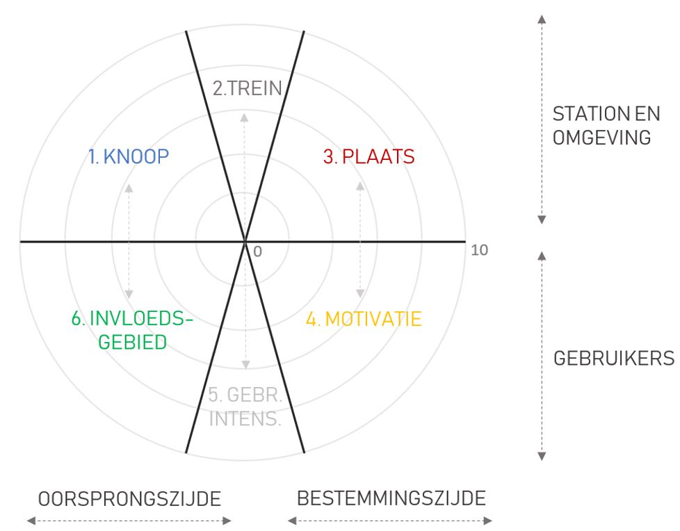
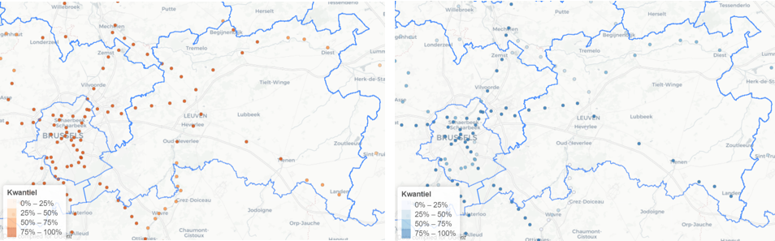
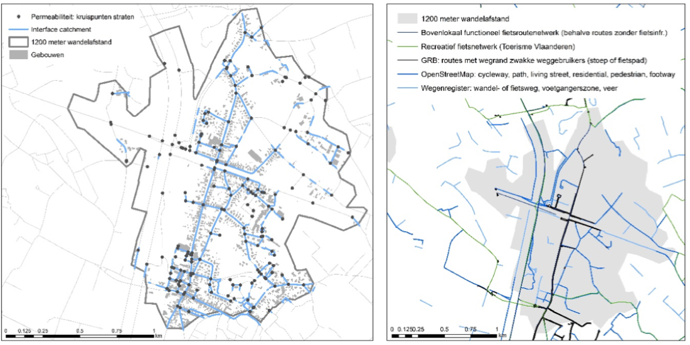

 

 
 

</img>

 __**1. KNOOP**__   
Dit deel focust op de bereikbaarheid van en naar het station met verschillende ‘feeder’ vervoersmodi: de **fiets**, de **auto** en het **openbaar vervoer** (OV: bus, tram en metro). De fiets en de auto dimensies bevatten telkens het aantal aanwezige parkeerplaatsen. Indien het gedetaileerde diagram wordt geraadpleegd, dan kan ook een onderscheid gemaakt worden in gratis en betalende parking. De OV-dimensie weerspiegelt hoe bereikbaar het station is per bus, tram en metro. Twee indicatoren zijn berekend voor de OV-haltes die zich vlakbij het station bevinden (minder dan 300 meter wandelen) op basis van de meest recente GTFS ^1 data: 

1- Het aantal vertrekkende bussen, trams en metro’s op een weekdag (dinsdag);  
2- Het aantal unieke OV-routes (of ‘lijnen’, zoals pakweg de busnummers 58 en 67 verschillende routes zijn) die beschikbaar zijn op een weekdag (dinsdag).  

Belbushaltes worden niet mee opgenomen en de drie ov-modi krijgen alle hetzelfde gewicht. De scores voor alle geselecteerde OV-haltes worden per station geaggregeerd (gesommeerd en nadien genormaliseerd), zodat uiteindelijk een finale score per indicator per station wordt bekomen.

^1 *General Transit Feed Specification Data*
 
 

 __**2. TREIN**__   
Dit deel omvat informatie over de bereikbaarheid van het station per trein, en dit voor verschillende momentopnames. Naast de **frequentie** in dienstregeling (het aantal vertrekkende treinen op een dinsdag, op een zaterdag en off-peak tussen 9u en 14u), wordt de **amplitude** weergegeven. Dit is het dagdeel waarin treindiensten beschikbaar zijn. Indien bijvoorbeeld het eerste treinvertrek om 5u07 is en de laatste aankomst om 23u54, dan bedraagt het dagdeel of de amplitude 18u47 of 0.78. 
Verder worden er ook twee **centraliteitsmaten** weergegeven (zie figuren onder), die gebaseerd zijn op het werk van Curtis en Scheurer (2010; 2016). Het gaat om twee centraliteitsmaten (wij noemen ze hier ‘reistijdcentraliteit’ en ‘overstapcentraliteit’) die enkele jaren geleden ook voor alle Vlaamse en Brusselse treinstations berekend werden door VITO (zie Verachtert et al. 2016). Wij berekenden deze indicatoren op basis van de geplande dienstregeling van NMBS (verkregen via de vrij beschikbare GTFS data). 
De **reistijdcentraliteit** geeft een algemeen beeld van hoe vlot je vanuit een bepaald station alle andere stations in het netwerk kunt bereiken op basis van de minimale reistijd en de frequentie van de dienstverlening. Hoe korter de reistijd en hoe hoger de frequentie, hoe hoger de score. Deze indicator werd berekend op basis van alle stations opgenomen in de GTFS data (alle Belgische stations, maar ook de belangrijkste Nederlandse, Duitse, Luxemburgse en de Franse stations nabij de grens). De **overstapcentraliteit** berekent een andere vorm van centraliteit, namelijk hoeveel overstappen genomen moeten worden om vanuit een bepaald station alle andere stations in het netwerk te bereiken. Ook deze is berekend ten opzichte van alle stations in de GTFS dataset. Voor beide maten wordt een kleurenschaal toegewezen op basis van kwantielen, en is het mogelijk om de scores te vergelijken voor een reguliere weekdag (een dinsdag) en een weekenddag (het gemiddelde van een zaterdag en zondag). 
 
 

Reistijdcentraliteit (dinsdag) &nbsp &nbsp Overstapcentraliteit (dinsdag)</img>

 __**3. PLAATS**__   
Dit deel bevat informatie over de ruimtelijke ontwikkelingen rondom het station, en meer specifiek in de oppervlakte die bereikt kan worden in een kwartier stappen (1200 meter). In lijn met de transit-oriented development literatuur (zie onder andere Calthorpe 1997 en Cervero en Kockelman 1997) worden **drie plaatsdimensies** onderzocht: densiteit, diversiteit en design. 
De **densiteit** weerspiegelt ‘hoe veel’ er te doen is in de stationsbuurt en is opgesplitst in vijf indicatoren: jobdichtheid (data aangemaakt door Verachtert et al. 2016), inwonersdichtheid (FOD Binnenlandse Zaken, 2013), en de dichtheid aan basis, regionale en metropolitane voorzieningen ^2 (data aangemaakt door Verachtert et al. 2016). Densiteit wordt opgenomen omdat er een positief verband verondersteld wordt tussen densiteit en het aantal potentiële gebruikers van het station. Bovendien leren eerdere studies dat hoge dichtheden over het algemeen zorgen voor voor een kleinere gemiddelde afstand tussen woning, werkplek en voorzieningen waardoor ook in de buurt van het station verplaatsingen op een meer duurzame manier (wandelen en fietsen) zouden kunnen gebeuren.
**Diversiteit** van ruimtelijke ontwikkelingen is ook belangrijk. Een hoge mate van functiemenging draagt namelijk bij aan een divers gebruik van de knoop. Arbeidsplaatsen trekken reizigers aan in de ochtendspits, voorzieningen trekken doorheen de dag bezoekers, en woningen zorgen voor reizigers die dan weer vanuit de knoop vertrekken in de ochtendspits. Verschillende functies zorgen dus voor verschillende reismotieven op verschillende momenten, waardoor er potentieel is voor een optimale benutting van de spoorinfrastructuur. Meer menging kan daarnaast ook zorgen voor een lagere reisbehoefte omdat de gemiddelde afstand tussen woning, werkplek en voorzieningen over het algemeen kleiner is. Diversiteit in functies is daarom belangrijk voor een duurzaam spoornetwerk en een duurzame stationsbuurt. In de StationsRadar tool werd diversiteit gemeten op basis van een categorisering in drie types landgebruik: wonen, werken en voorzieningen. Dankzij het landgebruiksbestand ^3 aangeleverd door VITO (versie 2013), konden deze categorieën op 10 x 10 meter rasterresolutie in kaart worden gebracht. Op basis van een Shannon diversiteitsindex werd vervolgens berekend in welke mate de drie types ‘in balans’ zijn binnen elke wandelbare buffer (in termen van de ingenomen oppervlakte). Een nadeel van deze methode is dat geen rekening wordt gehouden met meerdere functies op een rastercel (een appartementsgebouw boven een winkel bijvoorbeeld). Deze diversiteitsindex reflecteert ook niet de ruimtelijke mix van functies hoewel dit ook belangrijk is (een grote ruimtelijke scheiding tussen de drie types is immers nefast voor de ‘walkability’ of ‘bewandelbaarheid’ van de buurt). We zijn momenteel bezig om dit in kaart te brengen. 
Tot slot weerspiegelt de **design** dimensie eigenschappen van de bebouwde omgeving die volgens de literatuur de bewandelbaarheid van de buurt zouden moeten verhogen. De eigenschappen die in het roosdiagram zijn opgenomen focussen specifiek op de morfologie van de publieke ruimte in de stationsbuurt. In onderstaande figuren worden de indicatoren verder verduidelijkt. ‘Interface’ geeft een waardering voor de grootte van het scheidingsvlak (of de interface) tussen publieke en private ruimte in de stationsbuurt. Hoe groter de interface hoe meer toegang tot allerlei stedelijke functies en hoe makkelijker de buurt te bewandelen is. Deze indicator geeft dus informatie over ‘hoe veel’ er binnen deze oppervlakte te vinden is. In onderstaande figuur wordt duidelijk hoe deze proxy voor publiek/private interface precies opgemeten is. In lijn met Pafka en Dovey (2018) noemen wij deze indicator ‘interface catchment’ of kortweg dus ‘interface’. 
Een tweede design indicator, ‘permeabiliteit’, geeft meer informatie over de mate waarin de stationsbuurt ‘doordringbaar’ is in termen van kruispunten in het stratennetwerk. Hoe meer kruispunten, hoe makkelijker men kan navigeren (grote ondoordringbare blokken verminderen het gemak om te wandelen en fietsen). 
Tot slot wordt ook de totale lengte van fiets- en wandelpaden binnen de wandelbuffer opgemeten. De data die hiervoor wordt gebruikt is samengesteld uit verschillende vrij beschikbare bronnen: het bovenlokaal functioneel fietsroutenetwerk, het recreatief fietsnetwerk, de categorie ‘wegopdeling’ van het GRB, de categorieën cycleway, path, living street en residential van OpenStreetMap en het Wegenregister van AWV. De totale lengte van deze fiets-en wandelinfrastructuur wordt opgemeten (ook waar deze overlappen) en is gereflecteerd in de indicator ‘fietswandel’. 

^2 *Definities gebaseerd op Ruimte Vlaanderen, werktekst van het Witboek Beleidsplan Ruimte Vlaanderen (versie november 2015). Zie ook Verachtert et al. (2016) voor meer duiding bij de types voorzieningen.*  
^3 *https://ruimtemodel.vlaanderen/c/23/*
 
 

Ruimtelijke data design indicatoren – station Landegem</img>

 __**4. MOTIVATIE**__   
Dit deel van het diagram heeft betrekking op de **bestemmingszijde** van het station. Het visualiseert wie er vooral naar dit station reist: scholieren (secundair onderwijs), studenten (hoger onderwijs) of werkenden. Deze drie categorieën zijn afgeleid uit NMBS abonnementsdata. De vierde categorie ‘andere’ reflecteert de losse ticketverkoop, en dus de hoeveelheid biljetten die gekocht worden met het specifieke station als bestemming. 
De plaats die dit deel ‘motivatie’ heeft in het roosdiagram (aan de rechterzijde, onder het deel ‘plaats’) is doelbewust gekozen. In conceptuele zin zijn beide delen immers met elkaar gelinkt gezien de motivaties voor het reizen naar bepaalde stations sterk samenhangen met de plaats-eigenschappen van de stationsbuurt. 
 
 

 __**5. GEBRUIKERSINTENSITEIT**__   
Het deel gebruikersintensiteit reflecteert twee zaken. Enerzijds wordt het aantal mensen dat op een reguliere weekdag opstapt in het station gevisualiseerd, centraal in het deel (gebaseerd op de oktobertellingen uit 2017). Links en rechts van deze indicator wordt weergegeven in hoeverre het station als oorsprongstation (links) of als bestemmingsstation (rechts) fungeert. Ook hier is de weergave van het bestemmingskarakter aan de rechterzijde van het diagram (en vice versa) een bewuste keuze, gezien dit kenmerk samenhangt met de motieven van de reizigers om het station te willen bereiken. Deze data werd aangeleverd door NMBS en is berekend op basis van abonnementsdata en individuele ticketverkoop. 
Dit deel ‘gebruikersintensiteit’ wordt bewust centraal en tegenover het ‘trein’ deel weergegeven in het diagram. Beide delen geven immers respectievelijk inzicht in vraag en aanbod van het treintransport vanuit en naar het knooppunt.
 
 

 __**6. INVLOEDSGEBIED**__   
Terwijl het deel ‘motivatie’ betrekking heeft op de bestemmingszijde van het station, heeft dit deel vooral betrekking op de **oorsprongszijde** van het station. Het geeft weer hoe ver de gebruikers van het station wonen van het station, en geeft zodoende een idee van de grootte van het invloedsgebied van het station. Het deel is opgesplitst in drie dimensies volgens afstanden: wandelafstand (> 900 m Euclidische afstand), fietsafstand (tussen 900 en 3000 m) en verder (> 3000 m). Deze data kon opnieuw verkregen worden uit de abonnementsdata en is aangeleverd door NMBS. De data spitst zich hier enkel toe op de gebruikers van het station die er opstappen (en het station dus als vertrekstation gebruiken). 
Net zoals het ‘motivatie’ deel bewust aan de rechterzijde van het diagram wordt weer-gegeven, wordt dit deel bewust aan de linkerzijde geplaatst. Het houdt immers verband met het ‘knoop’ deel dat erboven is weergegeven. Indien het invloedsgebied van het station erg groot is (en de meeste gebruikers dus verder wonen dan 3 km), zullen de meesten vermoedelijk beroep doen op de auto en/of het openbaar vervoer om het station te bereiken. Een voldoende busbereikbaarheid van het station zou zich met name in die gevallen kunnen rechtvaardigen als duurzame ontsluiting van het station (wat op zijn beurt geraadpleegd kan worden in het knoop deel). 
